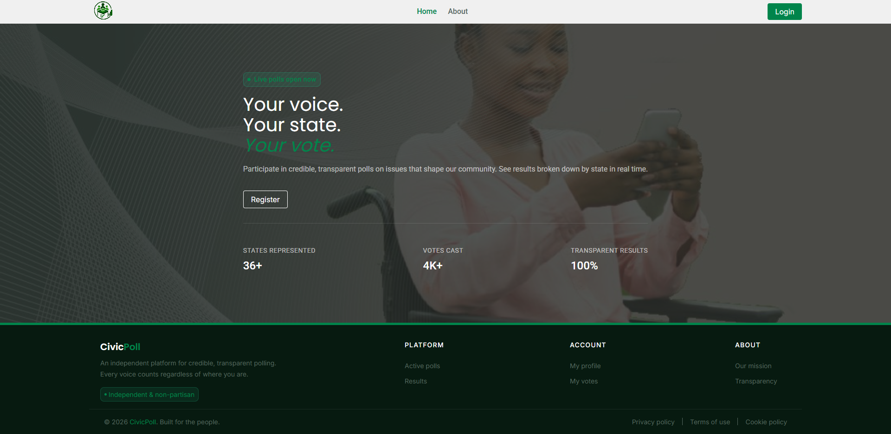

# CivicPoll

**CivicPoll** is a digital polling and civic engagement platform that empowers citizens to voice their opinions on issues that directly affect their communities, all from the comfort of their homes.

The platform enables users to participate in transparent public polls and view real-time results that reflect public sentiment at both local and broader levels. Votes can be filtered and aggregated by state, providing clear regional insights into the issues that matter most to people.

By making civic participation more accessible, CivicPoll helps governments, organizations, and communities better understand public opinion and make more informed decisions driven by the people themselves.

---

## Get running in 5 minutes

### Prerequisites

- [Node.js](https://nodejs.org/) v18+
- [Angular CLI](https://angular.io/cli) v17+
  ```bash
  npm install -g @angular/cli
  ```

### Install & run

```bash
# 1. Clone the repo
git clone https://github.com/ogedengbewisdom/civic-voting-poll-FE.git
cd civic-voting-poll-FE

# 2. Install dependencies
npm install

# 3. Set up environment variables
cp .env.sample .env

# 4. Start the dev server
npm start
```

Open [http://localhost:4200](http://localhost:4200) — you should see the CivicPoll home page.

---

## Project structure

```
civic-voting-poll/
├── src/
│   ├── environments/
│   │   ├── environment.ts                 # Local dev config (git-ignored)
│   │   └── environment.development.ts
│   │
│   ├── layouts/
│   │   ├── auth-layout/                   # Wrapper for login, register pages
│   │   ├── main-layout/                   # Sidebar + top nav for protected pages
│   │   └── shell-layout/
│   │
│   ├── pages/
│   │   ├── about/
│   │   ├── home/
│   │   ├── not-found/
│   │   │
│   │   ├── auth/                          # Public auth pages
│   │   │   ├── forgot-password/
│   │   │   ├── guard/
│   │   │   ├── interceptor/
│   │   │   ├── interface/
│   │   │   │   └── index.ts
│   │   │   ├── login/
│   │   │   ├── logout-modal/
│   │   │   ├── register/
│   │   │   ├── reset-password/
│   │   │   ├── service/
│   │   │   └── auth.routes.ts
│   │   │
│   │   └── protected/                     # Protected pages
│   │       ├── manage-polls/              # Admin poll management table
│   │       │   ├── createpoll-modal/
│   │       │   ├── pollaction-modal/      # Edit / Close / Delete confirm
│   │       │   ├── manage-polls.html
│   │       │   ├── manage-polls.css
│   │       │   ├── manage-polls.ts
│   │       │   └── manage-polls.spec.ts
│   │       ├── manage-users/
│   │       ├── poll-detail/               # Poll detail + voting panel
│   │       ├── poll-result/               # Live results with state filter
│   │       ├── polls/                     # Public poll listing
│   │       ├── profile/
│   │       ├── service/
│   │       └── protected.routes.ts
│   │
│   ├── shared/
│   │   ├── components/                    # Reusable UI components
│   │   │   ├── button/                    # app-button
│   │   │   ├── empty-state/
│   │   │   ├── error-state/
│   │   │   ├── footer/
│   │   │   ├── loader/
│   │   │   ├── modal/                     # app-modal base wrapper
│   │   │   ├── nav-bar/
│   │   │   ├── pagination/                # app-pagination
│   │   │   ├── password-input/
│   │   │   ├── select-input/
│   │   │   ├── text-area/
│   │   │   ├── text-input/
│   │   │   └── toast/                     # app-toast notifications
│   │   ├── pipes/
│   │   ├── service/
│   │   └── utils/
│   │
│   ├── env.d.ts
│   ├── index.html
│   ├── main.ts
│   └── styles.css                         # Global CSS design tokens
│
├── .env                                   # Git-ignored — copy from .env.sample
├── .env.sample                            # Commit this — template for new devs
├── .editorconfig
├── .gitignore
├── angular.json
├── package.json
├── tsconfig.app.json
├── tsconfig.json
└── tsconfig.spec.json
```

---

## Design system

All design tokens live in `src/styles.css` as CSS custom properties. **Never hardcode colours, spacing, or font sizes** — always use a variable.

| Token group     | Examples                                                                |
| --------------- | ----------------------------------------------------------------------- |
| **Brand**       | `--color-primary` `--color-secondary`                                   |
| **Backgrounds** | `--color-bg` `--color-bg-dark` `--color-surface`                        |
| **Text**        | `--color-text` `--color-link`                                           |
| **States**      | `--color-error` `--color-success` `--color-warning`                     |
| **Spacing**     | `--spacing-xs` → `--spacing-2xl`                                        |
| **Radius**      | `--radius-sm` `--radius-md` `--radius-lg`                               |
| **Fonts**       | `--font-body` (Roboto) `--font-heading` (Poppins) `--font-text` (Inter) |

---

## Environment variables

Copy `.env.sample` to `.env` and fill in your values:

```bash
API_BASE_URL=http://localhost:3000
```

---

## Roles & access

| Role      | Access                                  |
| --------- | --------------------------------------- |
| **user**  | View polls, vote, view results, profile |
| **admin** | All of the above + manage polls         |

Route guards in `src/pages/auth/guard/` protect authenticated and admin routes. If you hit a redirect loop, check that your `API_BASE_URL` is correct and the backend is running.

---

## Key patterns to know

**1. Destructive actions always go through a confirm modal**

Never call a delete or close API directly from a button. The flow is always:

```
Button click → emit event → parent closes detail panel → confirm modal opens → user confirms → API call
```

**2. Children emit, parents act**

Child components only emit `@Output()` events. Parents own all state and make all API calls.

---

## Running tests

```bash
# Unit tests
npm test
```

---

## Build for production

```bash
npm run build
```

Output goes to `dist/civic-voting-poll/`.

---

## Contributing

1. Branch off `main` — use `feature/your-feature` or `fix/your-fix`
2. Follow the existing component structure (standalone components, BEM-style CSS classes)
3. Use CSS variables — no hardcoded values
4. Open a PR and request a review

---

## Preview



---

---

## Author

Built by **Wisdom Ogedengbe** as a capstone project for the Seamfix Developer Program.
